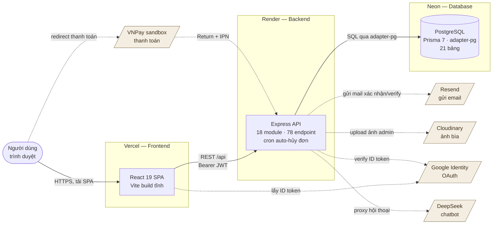
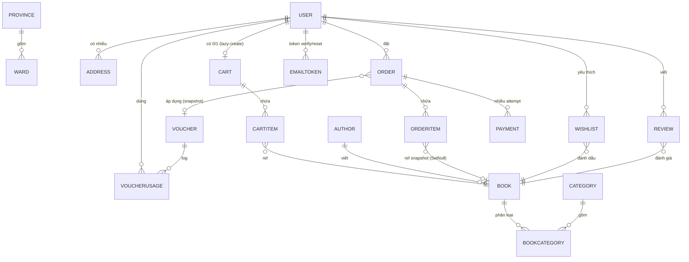
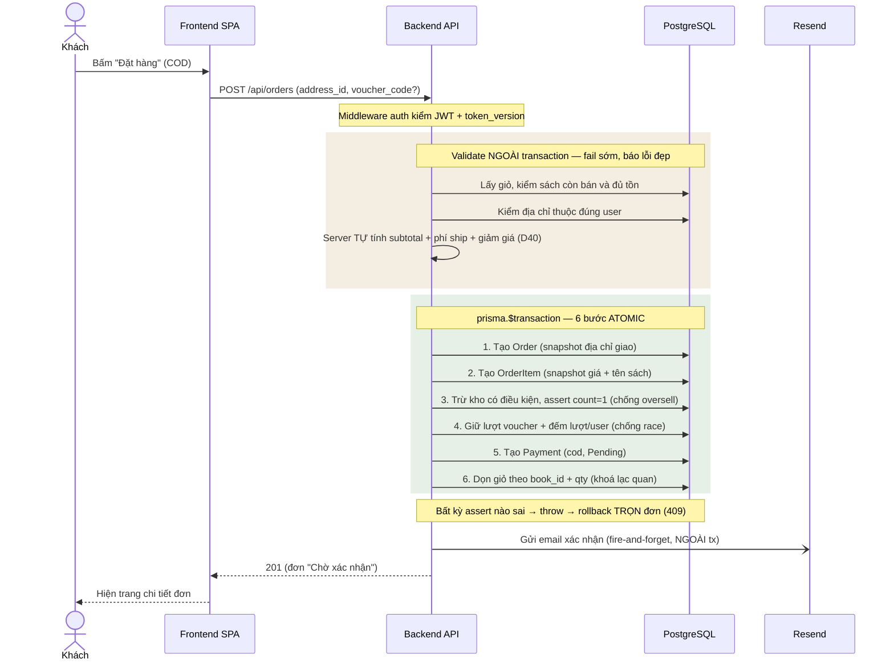
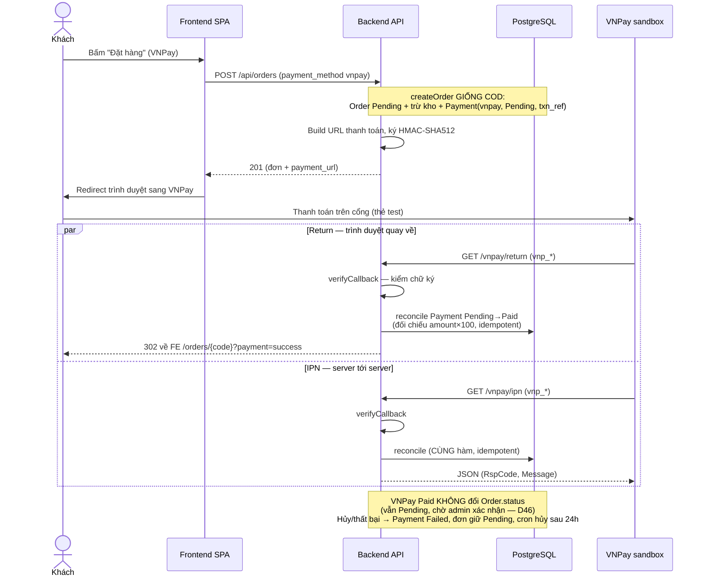

# Sơ đồ cho báo cáo — Ánh Sách

> File "một cửa" gom các sơ đồ dùng cho báo cáo/bảo vệ đồ án. Tất cả viết bằng **Mermaid**
> (nhất quán với ERD trong `THIET-KE.md` mục 5.4). Xem cách chuyển sang ảnh PNG/SVG để dán vào
> Word ở ngay bên dưới.

## Cách xuất Mermaid ra ảnh PNG/SVG (để chèn vào Word)

Chọn 1 trong 3 cách, dễ nhất trước:

1. **mermaid.live (khuyên dùng, không cài gì):**
   - Mở https://mermaid.live
   - Dán đoạn code trong khối ```mermaid (chỉ phần bên trong, không gồm 3 dấu ```) vào ô bên trái.
   - Bên phải hiện hình → menu **Actions → PNG** (nền trong) hoặc **SVG** (nét sắc, phóng to không vỡ).
   - Word: Insert → Picture. Nếu cần nền trắng, chọn PNG rồi đặt trên nền trắng của trang.

2. **VS Code (xem nhanh trong lúc sửa):**
   - Cài extension *Markdown Preview Mermaid Support* → mở file `.md` này → `Ctrl+Shift+V` để xem.
   - Chuột phải vào sơ đồ → *Copy Image* (một số phiên bản), hoặc dùng cách 1 để lấy ảnh chuẩn.

3. **CLI (nếu muốn tự động hoá):**
   - `npm i -g @mermaid-js/mermaid-cli` rồi `mmdc -i soure.mmd -o out.png -b transparent`.

> Mẹo cho báo cáo Word: xuất **SVG** rồi chèn — in ra vẫn nét; nếu bản Word của trường không nhận
> SVG thì xuất **PNG scale 2x** (mermaid.live có nút chọn tỉ lệ).

---

## 1. Sơ đồ kiến trúc tổng thể (Deployment)

**Dùng cho:** chương *Kiến trúc & Triển khai*. Cho hội đồng thấy hệ thống chạy ở đâu và các thành
phần gọi nhau thế nào. 3 tầng tự triển khai (Vercel · Render · Neon) + 5 dịch vụ ngoài.



**Ghi chú bảo vệ (các điểm dễ bị hỏi):**

- **Tiền luôn do backend tính** — FE chỉ gửi `address_id`/`voucher_code`, không gửi số tiền (D40).
- **VNPay có 2 đường callback**: *Return* (trình duyệt user quay về) để demo chạy ngay, và *IPN*
  (VNPay gọi thẳng server→server) là nguồn sự thật khi đã public URL. Cùng 1 hàm đối soát
  idempotent nên gọi chồng chỉ ghi nhận 1 lần (D47).
- **Google OAuth không cần server session**: FE lấy ID token từ Google, backend chỉ verify chữ ký
  + audience bằng `google-auth-library` (D60) — không dùng Passport/redirect.
- **Cron auto-hủy đơn** đặt ở `server.ts` (không ở `app.ts`) để test import app không spawn job;
  Render bản free ngủ sau ~15 phút nên cron không chạy lúc ngủ (chấp nhận cho đồ án).
- **Secret chỉ nằm ở backend** (Render env). Biến `VITE_*` của frontend là công khai, không chứa
  secret — chỉ có `VITE_API_URL` và `VITE_GOOGLE_CLIENT_ID`.

---

## 2. Sơ đồ quan hệ thực thể — ERD (21 bảng)

**Dùng cho:** chương *Phân tích & Thiết kế CSDL* — phần chấm điểm cao. Bản này khớp 100% với
`backend/prisma/schema.prisma` (đối chiếu 2026-07-03) và đồng bộ với `THIET-KE.md` mục 5.4.



> 3 bảng cấu hình **đứng riêng, không FK**: `SHIPPINGZONE` (phí ship theo tỉnh + `distance_km`),
> `SHIPPINGCONFIG` (singleton công thức phí — D62), `SITESETTING` (key-value thông tin shop).
> Cố ý không vẽ vào sơ đồ quan hệ để giữ ERD gọn.

**Ký hiệu cardinality (Mermaid crow's-foot):** `||` = đúng 1 (bắt buộc); `o|` = 0 hoặc 1;
`o{` = 0 hoặc nhiều; `}o` = nhiều (từ 0). Ví dụ `USER ||--o| CART` = mỗi user có **0 hoặc 1**
giỏ (giỏ chỉ sinh khi user lần đầu thêm hàng — lazy-create).

### Quan hệ đặc biệt cần giải thích khi bảo vệ

Đây là các chỗ **cố ý KHÔNG dùng khóa ngoại (FK)** — mỗi cái có lý do thiết kế, hội đồng hay hỏi:

| Chỗ | Cách làm | Vì sao KHÔNG FK |
|---|---|---|
| `ORDER` → địa chỉ giao | Snapshot 5 cột (`shipping_recipient_name`, `shipping_phone`, `shipping_province_name`, `shipping_ward_name`, `shipping_street`) | User xoá/sửa địa chỉ sau này thì đơn cũ vẫn đọc đúng nơi giao lúc đặt (SNAPSHOT — D25) |
| `ORDERITEM` → `BOOK` | Có FK nhưng **nullable + onDelete SetNull**, kèm snapshot `book_title`/`book_author_name`/`price_at_order`/`cover_image_url` | Admin xoá sách thì `book_id`=null nhưng lịch sử đơn KHÔNG vỡ; giá/tên giữ nguyên tại thời điểm mua |
| `ORDER` → `VOUCHER` | Có FK `voucher_id` (nullable) **nhưng** cũng snapshot `voucher_code`+`discount_amount` | FK chỉ để analytics + biết hoàn lượt cho mã nào khi huỷ; hiển thị đơn cũ đọc từ snapshot, không từ bảng Voucher (D54) |
| `REVIEW` → `ORDER` | **Không có** FK; verify "đã mua" bằng query `Order status=Delivered chứa book` lúc tạo | Thiết kế gốc có FK order_id nhưng bỏ đi — verify bằng query đủ + đơn giản hơn (D58) |
| `VOUCHERUSAGE.order_id` | `Int` thường, không FK | Chỉ cần để khi huỷ đơn xoá đúng dòng usage; không cần ràng buộc quan hệ |
| `ADDRESS`/`SHIPPINGZONE` → `PROVINCE`/`WARD` | Lưu `province_code`/`ward_code` dạng string, ghép tên thủ công khi cần | Địa giới tự host, đóng băng (D32); tránh phụ thuộc FK vào bảng danh mục ít đổi, đơn giản seed |

**Junction n-n:** `BOOK` ↔ `CATEGORY` đi qua bảng nối `BOOKCATEGORY` (composite PK `[book_id, category_id]`, cả 2 `onDelete: Cascade`) — 1 sách thuộc nhiều thể loại và ngược lại.

---

## 3. Sơ đồ tuần tự đặt hàng (Sequence)

**Dùng cho:** chương *Hiện thực* — mục nghiệp vụ lõi. Đây là luồng hội đồng hay hỏi sâu nhất;
2 sơ đồ dưới biến toàn bộ logic `modules/order` + `modules/payment` thành hình.

### 3.1 — Đặt hàng COD (nền tảng)



### 3.2 — Đặt hàng VNPay (thêm nhánh cổng thanh toán)



### Các bất biến (invariant) cần thuộc để trả lời vấn đáp

| Câu hỏi hội đồng có thể hỏi | Bất biến trong code |
|---|---|
| "2 người mua cuốn cuối cùng lúc thì sao?" | Trừ kho là 1 câu `updateMany` điều kiện `stock >= qty` + assert `count=1`; người thua `count=0` → 409 rollback. **Không bao giờ âm kho** (D45) |
| "Số tiền client gửi lên có bị tin không?" | KHÔNG. Body chỉ có `address_id/voucher_code/note/payment_method`. Subtotal từ giá DB, ship + discount server tự tính (D40) |
| "VNPay báo Paid thì đơn giao luôn?" | KHÔNG. Payment Paid ≠ Order status. Đơn vẫn Pending chờ **admin xác nhận** thủ công (D46) |
| "Return và IPN gọi chồng nhau thì cộng tiền 2 lần?" | KHÔNG. Cùng hàm `reconcile`, cập nhật `updateMany` điều kiện `status=Pending` → chỉ lật Paid **đúng 1 lần** (idempotent, D47) |
| "Khách trả tiền xong nhưng chưa xác nhận, để 24h thì bị hủy mất tiền?" | KHÔNG. Cron auto-hủy có filter `payments none Paid` → **bỏ qua đơn đã thu tiền** (D49) |
| "Gửi email lỗi thì đơn có hỏng không?" | KHÔNG. Email fire-and-forget + fail-soft, đặt NGOÀI transaction — mạng/Resend lỗi đơn vẫn đặt xong (D51) |
| "Đang đặt mà tab khác sửa giỏ thì sao?" | Bước 6 xoá giỏ theo đúng `(book_id, quantity)` đã đọc; lệch → `count` thiếu → 409 "giỏ vừa thay đổi" (khoá lạc quan) |

---

## 4. Khung viết báo cáo — ánh xạ nội dung ↔ nguồn có sẵn

Toàn bộ dữ liệu cho báo cáo đã nằm rải trong repo sau đợt rà soát 2026-07-02→03. Bảng này chỉ
cho biết **mỗi chương viết gì và lấy ở đâu** — không phải viết lại từ đầu.

| Chương báo cáo | Viết gì | Lấy từ (đã có sẵn) |
|---|---|---|
| 1. Giới thiệu & Mục tiêu | Bối cảnh bán sách "Ánh Sách", mục tiêu, phạm vi, khách hàng | `THIET-KE.md` mục 1–2 |
| 2. Công nghệ sử dụng | React 19/Express/Prisma 7/Postgres + 5 dịch vụ ngoài; giải thích thuật ngữ | `THIET-KE.md` mục 3 · `THUAT-NGU.md` |
| 3. Phân tích & Thiết kế | Yêu cầu chức năng (CORE/NICE), **21 bảng + ERD**, **sơ đồ kiến trúc**, decision log 62 quyết định | `THIET-KE.md` mục 4–6,10 · **file này mục 1 (kiến trúc) + mục 2 (ERD)** |
| 4. Hiện thực | 18 module, **luồng đặt hàng + 2 sequence**, transaction/chống race, snapshot | **file này mục 3** · `DEV-LOG.md` các phase · audit Bước 2 |
| 5. Bảo mật | 9 lớp (auth·RBAC·rate-limit 4 tầng·JWT token_version·upload magic-bytes·chatbot·IDOR·secrets·chống dò email) | audit Bước 3 (`KE-HOACH-KIEM-TRA-CODEBASE.md`) |
| 6. Kiểm thử | 264 unit test · coverage 85.8% · 12 case biên · smoke test production guest/user/admin | audit Bước 0,2,4,6 |
| 7. Triển khai | 3 tầng Vercel/Render/Neon, env, cold start ~26s, VNPay Return+IPN | `DEPLOY.md` · **file này mục 1** |
| 8. Kết luận & Hạn chế | Hạn chế (chưa integration test middleware, dialog `confirm()`, chunk `index` 560KB) + hướng phát triển | audit Bước 4,5,6 · `THIET-KE.md` mục 11 |
| Phụ lục | Ảnh chụp smoke test, các sơ đồ | phiên smoke test Bước 6 · file này |

### Số liệu chốt (mở đầu chương Hiện thực)

**≈14.300 dòng** mã nguồn (BE 4.989 + FE 9.313) · **3.691 dòng test** (264 test, coverage
**85.8%**) · **18 module** · **78 endpoint** · **21 bảng** · **9 migration** · **1 cron** ·
frontend 33 trang / 19 file API. Điểm nhấn: **tỉ lệ test/mã backend ≈ 74%**.

### Bộ "phao" vấn đáp — gom 1 chỗ

Khi bảo vệ, 4 bảng này trả lời gần hết câu hỏi kỹ thuật:

1. **7 invariant đặt hàng** — mục 3 file này (chống oversell, không tin tiền client, idempotent VNPay…).
2. **6 quan hệ cố ý không FK** — mục 2 file này (snapshot, SetNull, verify-by-query…).
3. **9 lớp bảo mật** — audit Bước 3 trong `KE-HOACH-KIEM-TRA-CODEBASE.md`.
4. **12 case biên nghiệp vụ** — audit Bước 2 trong `KE-HOACH-KIEM-TRA-CODEBASE.md`.

### Checklist trước khi nộp/bảo vệ

- [ ] Xuất PNG/SVG 4 sơ đồ (mục 1–3) chèn vào Word — xem hướng dẫn đầu file.
- [ ] Chụp bộ ảnh smoke test (trang chủ, chi tiết sách, checkout, đơn, dashboard admin) làm phụ lục.
- [ ] Warm-up backend Render ~1 phút trước khi demo (tránh cold start 26s trước hội đồng).
- [ ] (Tuỳ chọn) Xoá 1 review test 5 sao còn sót trên "Dragon Ball (Tập 1)".
- [ ] (Tuỳ chọn) Đổi env `MAIL_FROM` trên Render sang tên hiển thị "Ánh Sách".
